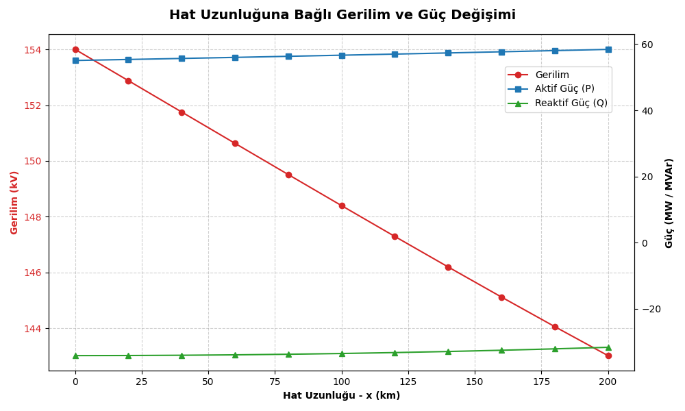
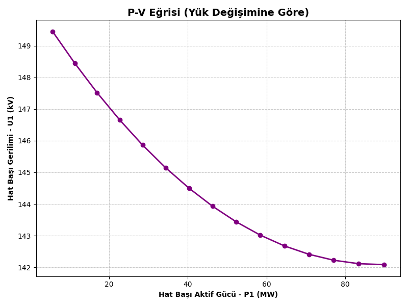

# ⚡ Transmission Line Parameter & Power Analysis Calculator

A comprehensive C and Python-based simulation tool to calculate transmission line parameters (R, L, C, ABCD) and perform advanced power, efficiency, and series compensation analysis for 154kV and 400kV high-voltage networks.

This project was developed as part of the **Electric Power Transmission** course at **Kocaeli University, Department of Electrical Engineering** (Group 6). I developed the software architecture and wrote the complete C/Python codebase, while the theoretical calculations and mathematical modeling were prepared collaboratively with my teammates.

---

## 📁 Repository Structure

* **`iletim1.c` (Phase 1):** Calculates core electrical parameters and circuit models based on conductor/tower geometry.
* **`iletim2.c` (Phase 2):** Performs dynamic power flow, line profiling, P-V curve generation, and series compensation analysis.
* **`cizim.py`:** Automated Python script that reads C-generated CSVs to plot engineering graphs.
* **`output_example/`:** Contains generated `csv` datasets and high-resolution `png` graphs.
* **`theoretical_calculations/`:** Text files detailing the algorithm flow and step-by-step mathematical models.
* **`project_spesifications/`:** Official course assignment PDFs and technical documentation.

---

## 📈 Automated Data Visualization

The Phase 2 software automatically exports computed data to CSV formats and triggers a Python backend to generate professional engineering curves. 

### 1. Distance-Based Line Profiling
Tracks voltage, active power (P), and reactive power (Q) across 10 specific nodes along the entire length of the transmission line.

### 2. P-V Curve Generation
Simulates grid stability by scaling the load from 10% to 150% (k = 0.1 to 1.5) and calculating the required sending-end voltage.

---

## 🚀 Key Features

### Phase 2: Advanced Power & Compensation Analysis
* **Power Flow & Efficiency:** Calculates sending-end voltage, current, active/reactive power, voltage regulation, and line efficiency based on user-defined receiving-end loads and power factors.
* **Series Compensation & Overload:** Evaluates grid survivability under extreme overloads (10x Nominal Load) and tests the restorative effects of 30% and 50% series capacitive compensation using the Equivalent Pi Circuit Model.

### Phase 1: Core Parameters
Calculates baseline parameters based on coordinate geometry:
* **R (Ω/km):** Alternating Current (AC) resistance.
* **L (mH/km):** Inductance (based on GMD and GMR).
* **C (nF/km):** Capacitance.
* **A, B, C, D Parameters:** Long transmission line circuit modeling using complex hyperbolic functions.

---

## 🏗️ Supported Configurations

**Conductor Types (8 Standard ACSR):**
795 MCM Drake | 795 MCM Tern | 954 MCM RAIL | 1192.5 MCM BUNTING | 477 MCM Hawk | 336.4 MCM Linnet | 954 MCM Cardinal | 1272 MCM Pheasant

**Tower Geometries:**
* **Type 1:** Single Circuit (No Bundle - PA Suspension)
* **Type 2:** Single Circuit (3-Bundle - Horizontal Layout, 3PA1)
* **Type 3:** Double Circuit (No Bundle - Vertical Layout, TA)
* **Type 4:** Double Circuit (2-Bundle, 2A)
